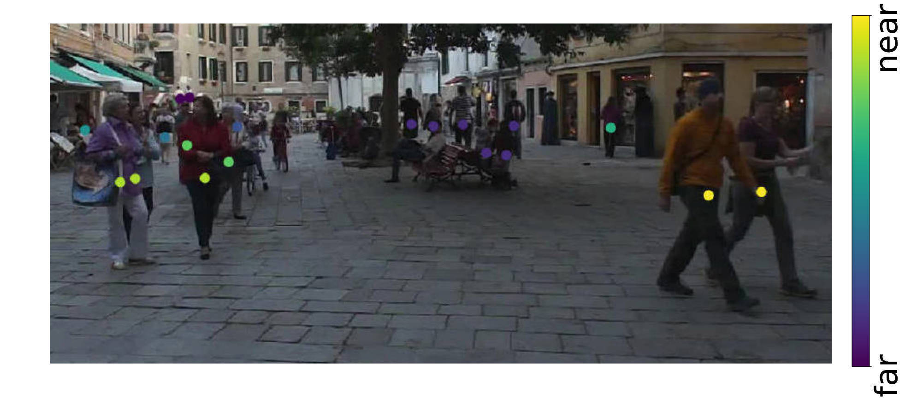
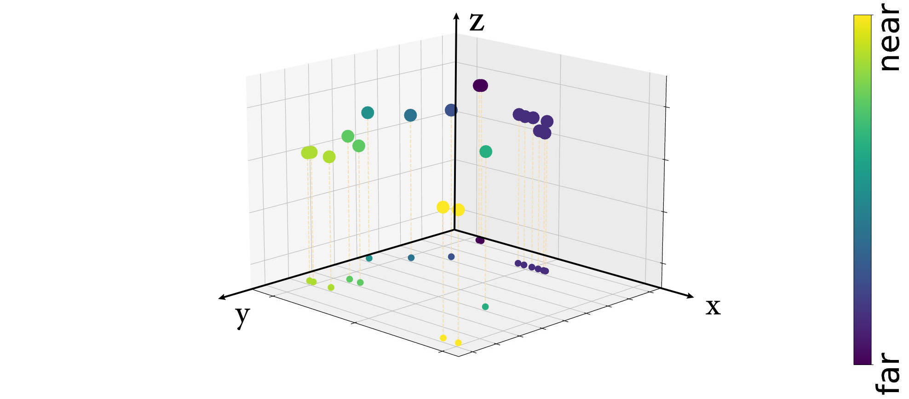
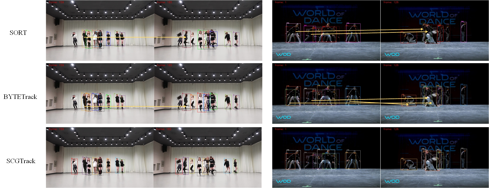

# SCGTrack
## Tracking performance
### Results on DanceTrack challenge test set
| Dataset    | HOTA | MOTA | AssA | IDF1 | IDs | FPS |
|------------|------|------|------|------|-----|-----|
| DanceTrack | 57.5 | 90.5 | 41.2 | 59.0 | 641 | 854 |
| MOT17      | 61.8 | 78.3 | 60.2 | 74.5 | -   | 280 |

### Visualization results on MOT challenge test set
   

  

## Installation
### 1. Installing on the host machine
Step1. Install ByteTrack.
```shell
git clone https://github.com/Yamahhh/SCGTrack.git
cd SCGTrack
pip3 install -r requirements.txt
python3 setup.py develop
```

Step2. Install [pycocotools](https://github.com/cocodataset/cocoapi).

```shell
pip3 install cython
pip3 install 'git+https://github.com/cocodataset/cocoapi.git#subdirectory=PythonAPI'
```

Step3. Others
```shell
pip3 install cython_bbox
```


## Data preparation

Download [MOT17](https://motchallenge.net/), [DanceTrack](https://github.com/DanceTrack/DanceTrack)and put them under <SCGTrack_HOME>/datasets in the following structure:
```
datasets
   |——————mot
   └——————DanceTrack

```

Then, you need to turn the datasets to COCO format and mix different training data:

```shell
cd <SCGTrack_HOME>
python3 tools/convert_mot17_to_coco.py
python3 tools/convert_mot20_to_coco.py
python3 tools/convert_crowdhuman_to_coco.py
python3 tools/convert_cityperson_to_coco.py
python3 tools/convert_ethz_to_coco.py
```

Before mixing different datasets, you need to follow the operations in [mix_xxx.py](https://github.com/ifzhang/ByteTrack/blob/c116dfc746f9ebe07d419caa8acba9b3acfa79a6/tools/mix_data_ablation.py#L6) to create a data folder and link. Finally, you can mix the training data:

```shell
cd <SCGTrack_HOME>
python3 tools/mix_data_ablation.py
python3 tools/mix_data_test_mot17.py
python3 tools/mix_data_test_mot20.py
```


## Model zoo

### Ablation model

Consultation by [ByteTrack](https://github.com/ifzhang/ByteTrack)
